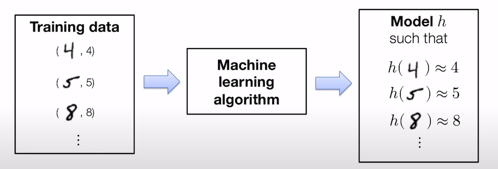
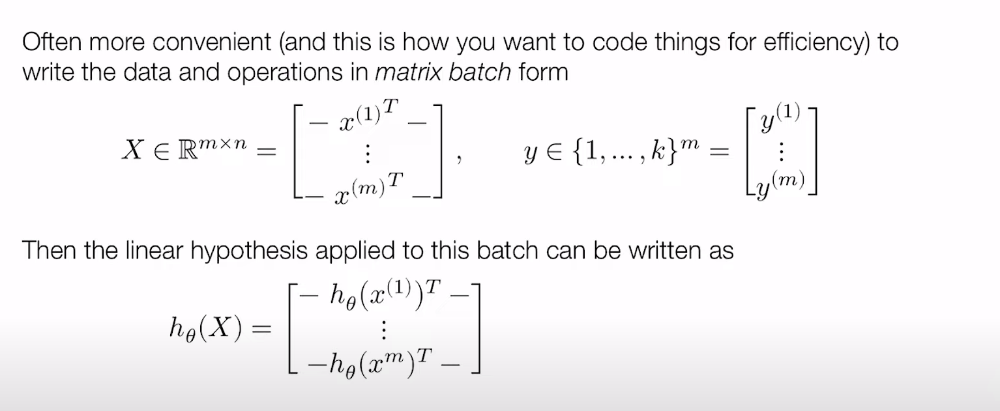

# ML Refresher / Softmax Regression

## Basic of machine learning

### Terminology

- Hypothesis Function, eg: for "univariate linear regression", the hypothesis function is: $h_\theta{(x)} = \theta_0 + \theta_1x$
- Cost (loss) Function: it is used to measure the accuracy of the hypothesis function: $J(\theta_0, \theta_1) = \frac{1}{2m}\sum_{i=1}^{m}(h_\theta(x_i)-y_i)^2$
- Gradient Descent: given the parameters of our hypothesis function, we can get the value of the cost function. And the goal is to get the smallest value of the cost function. The way we do this is by taking the derivative at that point, and it will give us a direction to move towards. Repeat until convergence: $\theta_j:=\theta_j-\alpha \frac{\partial}{\partial \theta_j} J(\theta_0,\theta_1)$ where $j=0,1$
- Sigmoid function
- Backpropagation algorithm: neural-network terminology for minimizing our cost function.

### Machine learning as data-driven programming

The ML approach: collect traing set of images with known labels and feed these into a *machine learning* algorithm, which will (if done well), automatically produce a "program" that solves this task.

Every machine learning algorithm consits of three three different elements:

1. The hypothesis class
2. The loss function
3. An optimization method

## Example: softmax regression

> Also known as multi-class logistic regression.

### Settings

- Traning data: $x^{(i)} \in \R^{n}, y^{(i)} \in \{1,...,k\} for i=1,...m$
- n = dimensionality of the input data
- k = number of different classes/labels
- m = number of points in the training set

Example: classification of 28\*28 MNIST digists:

- n = 28 \* 28 = 784
- k = 10
- m = 60,000

### Linear hypothesis function

Out hypothesis function maps inputs to k-dimentsional vectors.

$$h: \R^n \rightarrow \R^k$$

where $h_i(x)$ indicates some measure of "belief" in how much likely the label is to be class i.

A linear hypothesis function uses a linear operator for this transformation

$$h_\theta(x) = \theta^{T}x$$

for parameters $\theta \in \R^{n \times k}$

It can be represented in the form of matrix batch notation.

### Loss function
